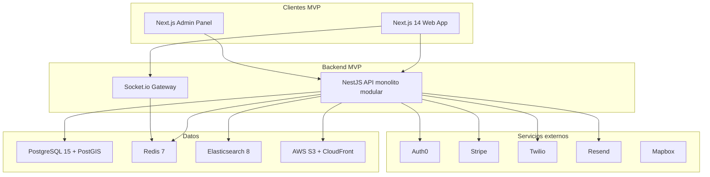
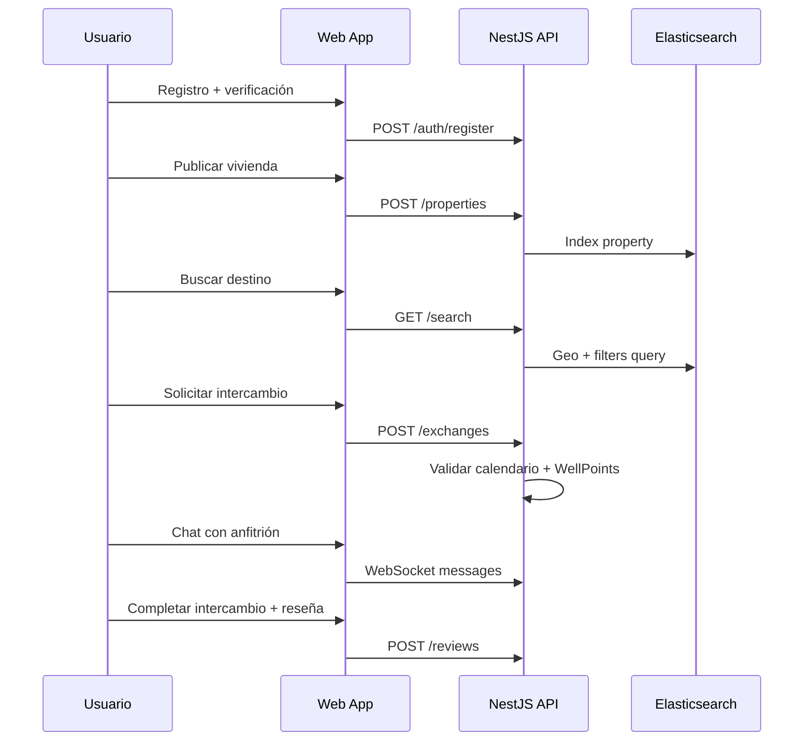
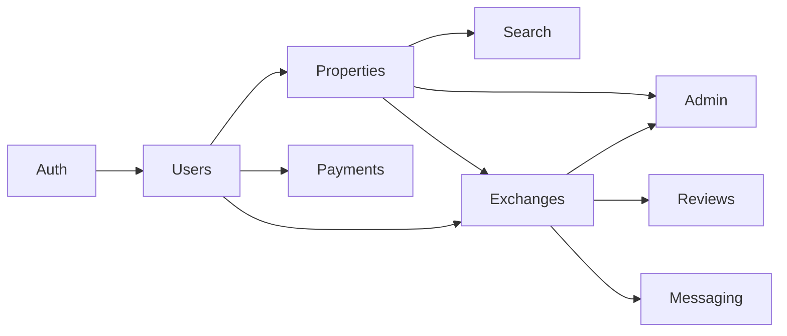

# Plan de Desarrollo Wellhouse — plan-cursor.md

## Contexto

El documento fuente [Wellhouse_Plan_Maestro.md](Wellhouse_Plan_Maestro.md) define la visión completa de **Wellhouse**: plataforma web (y futura móvil) de intercambio temporal de viviendas con modelo freemium, WellPoints, verificación en 3 niveles y enfoque hispanohablante.

El workspace actual **no contiene código** — solo el plan maestro y [plan-cc.md](plan-cc.md) (resumen estratégico de stack y roadmap). Este plan (`plan-cursor.md`) será la **hoja de ruta operativa para Cursor**: qué construir, en qué orden, con qué estructura de repos y qué queda fuera del MVP.

---

## Objetivo del MVP

Validar el modelo de negocio con usuarios reales en **10–12 meses**, entregando:

| Área | Incluido en MVP | Excluido (v2+) |
|------|-----------------|----------------|
| Auth | Email, Google OAuth, 2FA | Apple ID, Facebook OAuth |
| Viviendas | 1 vivienda/usuario, fotos, calendario | Múltiples viviendas, video tour |
| Búsqueda | Filtros básicos, lista, mapa (Mapbox) | IA, alertas avanzadas |
| Intercambio | Simultáneo + WellPoints básico | Intercambio directo avanzado |
| Chat | Texto en tiempo real (Socket.io) | Imágenes, traducción |
| Verificación | Nivel 1 (email + teléfono) | Niveles 2–3 (KYC documentos) |
| Pagos | Suscripción Premium (Stripe) | Marketplace de WellPoints |
| Plataforma | Web responsive (Next.js, PWA-ready) | Apps nativas iOS/Android |
| Admin | Gestión básica usuarios/propiedades | Analytics avanzados, BI |

---

## Decisión arquitectónica para el MVP

El plan maestro describe **microservicios**, pero para el MVP se recomienda un enfoque **modular monolítico** que evolucione sin rediseño:



**Justificación:** un solo servicio NestJS con módulos separados (`auth`, `users`, `properties`, `exchanges`, `messaging`, `search`, `notifications`, `payments`, `admin`) reduce complejidad operativa en fase 0–10K usuarios. La separación en microservicios queda planificada para la etapa de tracción (10K–100K usuarios), según sección 13 del plan maestro.

---

## Estructura de monorepo propuesta

```
wellhouse/
├── apps/
│   ├── web/                 # Next.js 14 — app pública
│   └── admin/               # Next.js 14 — panel interno
├── packages/
│   ├── api/                 # NestJS + Prisma
│   ├── shared/              # Tipos TS, validaciones Zod, constantes
│   └── ui/                  # Componentes shadcn/ui compartidos (opcional)
├── docker/
│   ├── docker-compose.yml   # PostgreSQL, Redis, Elasticsearch local
│   └── Dockerfile.api
├── infra/                   # Terraform / GitHub Actions (fase 3)
├── docs/
│   └── openapi.yaml
├── turbo.json               # Turborepo para builds paralelos
└── package.json
```

**Herramientas base:** pnpm workspaces + Turborepo, TypeScript estricto, ESLint + Prettier, Husky (pre-commit).

---

## Modelo de datos (Prisma) — entidades MVP

Basado en la sección 6 del plan maestro. Prioridad de implementación:

1. `User`, `Session`, `UserVerification`
2. `Property`, `PropertyAmenity`, `PropertyPhoto`, `AvailabilityBlock`
3. `Exchange`, `ExchangeRequest`
4. `Conversation`, `Message`
5. `Review`
6. `WellPointsLedger`
7. `Favorite`, `FavoriteList`
8. `Notification`
9. `Report`, `SupportTicket`
10. `Subscription`, `AuditLog`

Campos clave ya definidos en el plan maestro (ej. `exchanges.type`: `simultaneous | points | direct`; `exchanges.status`; `wellpoints_ledger.type`: `earned | spent | expired | bonus`).

---

## Roles y permisos (RBAC)

Implementar desde el inicio con guards NestJS + middleware Next.js:

| Rol | MVP |
|-----|-----|
| `USER_FREE` | 1 vivienda, 3 solicitudes/mes, chat |
| `USER_PREMIUM` | Solicitudes ilimitadas, WellPoints avanzados |
| `SUPERHOST` | Badge + visibilidad (post 10 intercambios, 4.8+) |
| `MODERATOR` | Moderación contenido, reportes |
| `SUPPORT` | Tickets, lectura de historial |
| `ADMIN` | Panel completo |
| `SUPER_ADMIN` | Config crítica, eliminación cuentas |

---

## Fases de implementación en Cursor

### Fase 0 — Bootstrap (Semana 1–2)

- Inicializar monorepo con pnpm + Turborepo
- `docker-compose.yml`: PostgreSQL 15 (PostGIS), Redis 7, Elasticsearch 8
- NestJS en `packages/api` con Prisma, migración inicial
- Next.js 14 en `apps/web` con Tailwind + shadcn/ui + next-intl (ES/EN)
- GitHub Actions: lint, test, build en PR
- Variables de entorno documentadas en `.env.example` (sin secretos)

**Entregable:** `pnpm dev` levanta web + API + DB local.

---

### Fase 1 — Auth y perfiles (Semanas 3–5)

**Backend (`packages/api/src/modules/auth`, `users`):**
- Registro/login email + password (bcrypt)
- Integración Auth0 para Google OAuth
- JWT access + refresh tokens; sesiones en Redis
- 2FA vía Twilio SMS
- CRUD perfil: nombre, bio, avatar (upload S3 + Sharp WebP)
- Verificación nivel 1: email (Resend) + teléfono (Twilio)

**Frontend (`apps/web`):**
- Pantallas: landing, registro, login, recuperación contraseña, onboarding perfil
- Layout autenticado con navbar responsive (mobile-first)

**Entregable:** usuario puede registrarse, verificar email/teléfono y completar perfil.

---

### Fase 2 — Viviendas y media (Semanas 6–8)

**Backend (`properties`, `media`):**
- CRUD vivienda (límite 1 por usuario free)
- Amenities, geocoding Mapbox (lat/lng)
- Upload multi-foto → S3 → thumbnails Sharp
- Calendario: `availability_blocks` (available/blocked/exchange)
- Moderación básica de fotos (`moderation_status`)

**Frontend:**
- Wizard publicación vivienda (pasos: info → fotos → amenities → calendario)
- Ficha pública de vivienda
- Edición y borrador/publicado

**Entregable:** usuario publica vivienda con fotos y calendario.

---

### Fase 3 — Búsqueda y mapa (Semanas 9–11)

**Backend (`search`):**
- Indexación Elasticsearch: título, ciudad, capacidad, amenities, geo
- Filtros: fechas, huéspedes, tipo, amenities, rango geo
- Sync Prisma → Elasticsearch vía Bull queue

**Frontend:**
- Página búsqueda: lista + mapa Mapbox side-by-side
- Filtros persistentes en URL
- Tarjetas de vivienda con foto cover, rating, ciudad

**Entregable:** búsqueda funcional con mapa interactivo.

---

### Fase 4 — Intercambios y WellPoints (Semanas 12–15)

**Backend (`exchanges`, `wellpoints`):**
- Flujo solicitud: pending → accepted/rejected/cancelled
- Intercambio simultáneo (fechas coinciden)
- WellPoints básico: ledger earn/spend, saldo por usuario
- Validaciones: disponibilidad calendario, límites free (3 req/mes)
- Bloqueo automático de fechas al confirmar

**Frontend:**
- Botón "Solicitar intercambio" en ficha vivienda
- Panel "Mis solicitudes" (enviadas/recibidas)
- Detalle intercambio con timeline de estados

**Entregable:** flujo completo de solicitud y confirmación de intercambio.

---

### Fase 5 — Mensajería y notificaciones (Semanas 16–18)

**Backend (`messaging`, `notifications`):**
- Socket.io gateway con Redis adapter
- Conversaciones ligadas a intercambios
- Notificaciones in-app + email (Resend) para eventos clave
- Bull workers para envío async

**Frontend:**
- Inbox de mensajes en tiempo real
- Badge de notificaciones no leídas
- Preferencias básicas de notificación

**Entregable:** chat funcional durante negociación de intercambio.

---

### Fase 6 — Confianza post-intercambio (Semanas 19–20)

**Backend (`reviews`, `reports`):**
- Reseñas doble ciega (publicación simultánea tras intercambio completado)
- Ratings: overall, cleanliness, communication, accuracy
- Reportes de usuario/vivienda
- Cálculo automático Superhost

**Frontend:**
- Formulario reseña post-intercambio
- Perfil con reseñas recibidas y badges
- Botón reportar

**Entregable:** ciclo de confianza cerrado.

---

### Fase 7 — Monetización y favoritos (Semanas 21–22)

**Backend (`payments`, `favorites`):**
- Stripe Checkout: plan Premium mensual
- Webhooks Stripe → actualizar `subscriptions` y rol
- Favoritos y listas básicas

**Frontend:**
- Página pricing / upgrade Premium
- Gestión suscripción en configuración
- Guardar viviendas en favoritos

**Entregable:** suscripción Premium operativa.

---

### Fase 8 — Panel admin (Semanas 23–25)

**App `apps/admin`:**
- Login con 2FA obligatorio
- Dashboard: usuarios, viviendas, intercambios activos
- Moderación fotos/textos pendientes
- Gestión reportes y tickets soporte
- Audit log de acciones admin

**Entregable:** equipo puede operar la plataforma sin acceso a BD.

---

### Fase 9 — QA, seguridad y beta (Semanas 26–30)

- Tests unitarios API (>80% módulos críticos): Jest + Supertest
- E2E web: Playwright (flujos registro → publicar → intercambiar → reseñar)
- Rate limiting (Redis), CORS, Helmet, validación Zod en todos los endpoints
- OWASP checklist: SQL injection (Prisma), XSS (sanitización), CSRF
- Pruebas de carga básicas (k6): búsqueda + auth
- Beta privada 100–500 usuarios

**Entregable:** informe QA + deploy staging en AWS.

---

### Fase 10 — Lanzamiento MVP (Semanas 31–34)

- Deploy producción: AWS (ECS/EKS o Railway inicial), RDS PostgreSQL, ElastiCache Redis
- CloudFront + S3 para media
- Sentry + Datadog básico
- GA4 + Mixpanel eventos clave (registro, publicación, solicitud, conversión Premium)
- SEO: SSR landing, sitemap, meta tags por vivienda
- Objetivo: 10K registros en 30 días post-lanzamiento

---

## Flujo de usuario MVP (referencia)



---

## Pantallas web MVP (prioridad)

Basado en sección 10 del plan maestro:

**Alta prioridad:**
1. Landing / marketing
2. Registro / login / 2FA
3. Onboarding perfil
4. Wizard publicación vivienda
5. Búsqueda (lista + mapa)
6. Ficha vivienda
7. Solicitud intercambio
8. Inbox mensajes
9. Dashboard usuario (mis viviendas, solicitudes, intercambios)
10. Reseñas post-intercambio
11. Configuración cuenta + Premium
12. Centro ayuda básico (FAQ estático)

**Admin (app separada):** dashboard, usuarios, viviendas, moderación, reportes.

---

## Convenciones para desarrollo en Cursor

- **Un módulo NestJS por dominio** con: controller, service, DTOs (class-validator), tests
- **API REST versionada:** `/api/v1/...`; documentar con Swagger/OpenAPI desde decoradores
- **Frontend:** App Router de Next.js; Server Components para SEO; Client Components solo donde haya interactividad
- **Estado cliente:** TanStack Query para datos servidor; Zustand solo para UI state local
- **i18n:** next-intl; strings en `messages/es.json` y `messages/en.json`
- **Commits:** Conventional Commits (`feat:`, `fix:`, `chore:`)
- **Branches:** `main` (prod), `develop` (staging), `feature/*` por módulo

---

## Dependencias entre módulos



No iniciar Exchanges sin Properties + Auth. No iniciar Reviews sin Exchanges completados. Search puede desarrollarse en paralelo a Messaging una vez Properties exista.

---

## Servicios externos — configuración MVP

| Servicio | Uso MVP | Env vars |
|----------|---------|----------|
| Auth0 | Google OAuth | `AUTH0_DOMAIN`, `AUTH0_CLIENT_ID`, `AUTH0_CLIENT_SECRET` |
| AWS S3 | Fotos | `AWS_S3_BUCKET`, `AWS_REGION`, `AWS_ACCESS_KEY_ID` |
| Resend | Email transaccional | `RESEND_API_KEY` |
| Twilio | SMS 2FA | `TWILIO_ACCOUNT_SID`, `TWILIO_AUTH_TOKEN` |
| Mapbox | Mapa + geocoding | `NEXT_PUBLIC_MAPBOX_TOKEN`, `MAPBOX_SECRET` |
| Stripe | Premium | `STRIPE_SECRET_KEY`, `STRIPE_WEBHOOK_SECRET` |
| Elasticsearch | Búsqueda | `ELASTICSEARCH_URL` |

Auth0, Stripe y Twilio pueden usar **modo sandbox/test** durante todo el desarrollo.

---

## Métricas de éxito MVP

- Tasa de activación: usuario publica vivienda en 7 días post-registro
- Tasa de match: solicitudes aceptadas / enviadas > 20%
- NPS post-intercambio > 40
- Conversión Free → Premium > 5%
- Uptime API > 99.5%

---

## Roadmap post-MVP (v2, no implementar ahora)

Según secciones 8 y 15 del plan maestro:
- Apps React Native + Expo (iOS/Android)
- Verificación KYC nivel 2–3 (Veriff)
- IA recomendaciones (OpenAI)
- Múltiples viviendas por usuario
- Apple/Facebook OAuth
- Marketplace WellPoints
- Analytics avanzados admin

---

## Relación con plan-cc.md

[plan-cc.md](plan-cc.md) cubre stack y roadmap estratégico de alto nivel. **plan-cursor.md** lo operacionaliza con: estructura de repo, fases semana a semana, módulos concretos, decisiones MVP (monolito modular vs microservicios) y checklist de entregables por fase.

---

## Próximo paso inmediato

1. Ejecutar Fase 0: bootstrap del monorepo Wellhouse
2. Configurar `docker-compose.yml` y primer esquema Prisma con entidades `User` y `Property`
